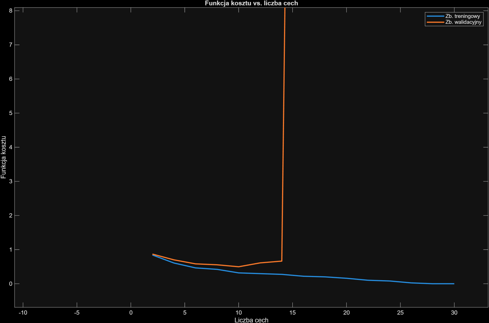
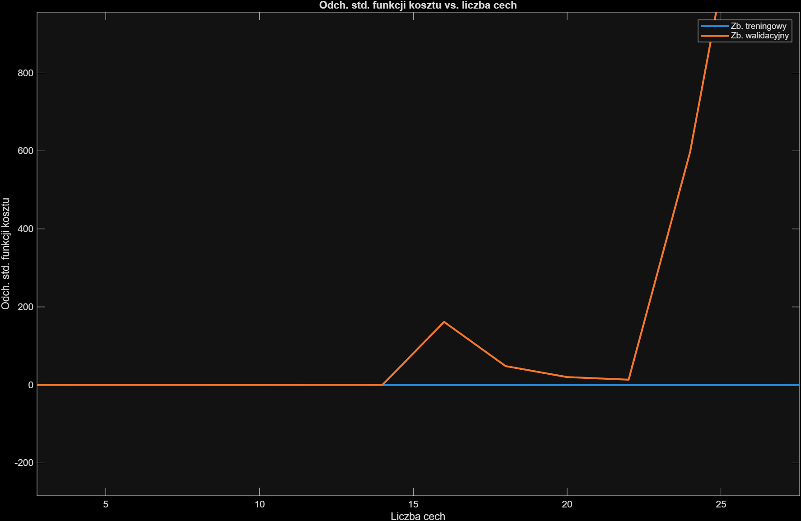
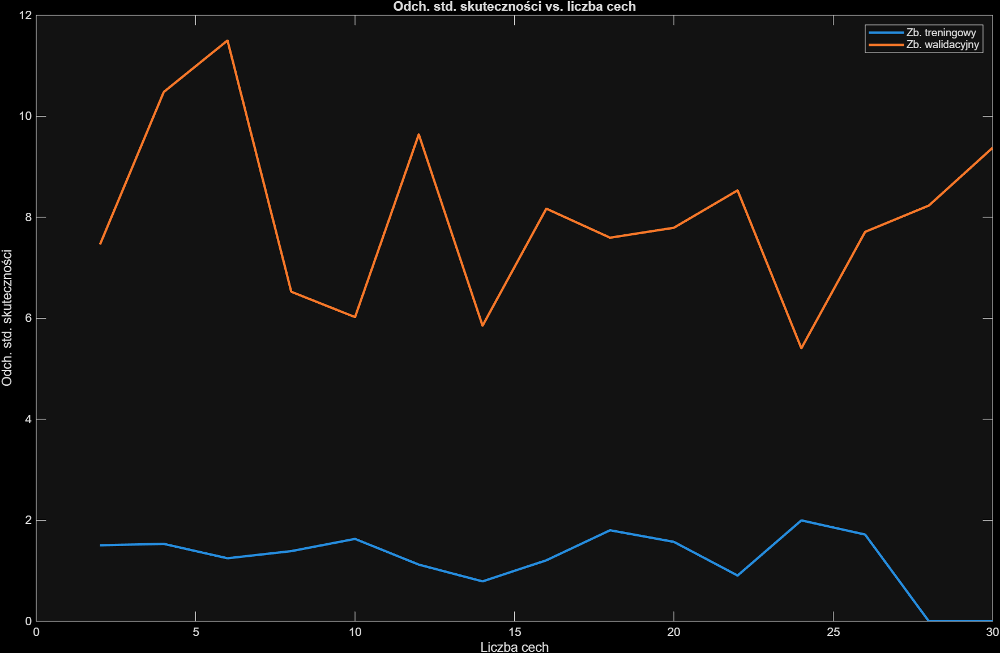
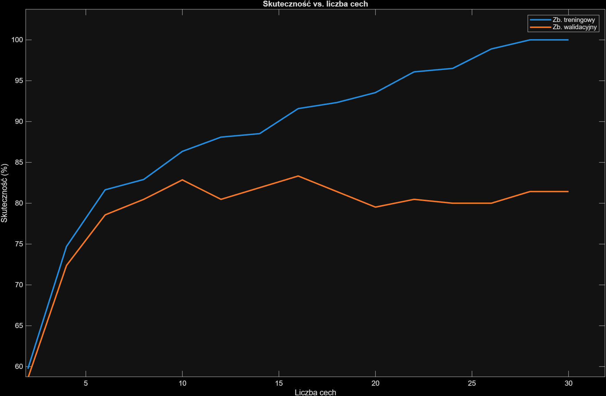
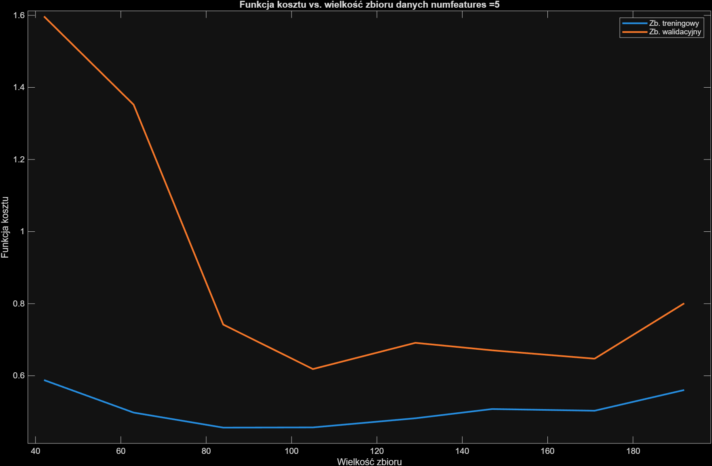
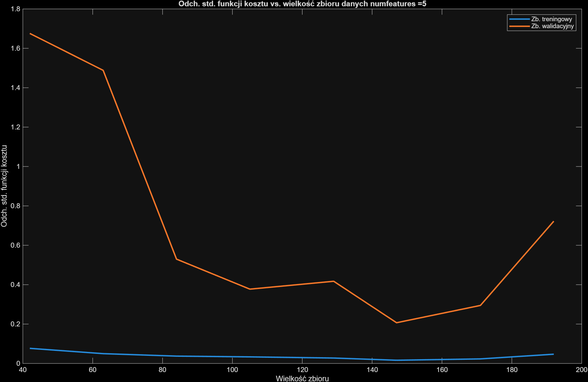
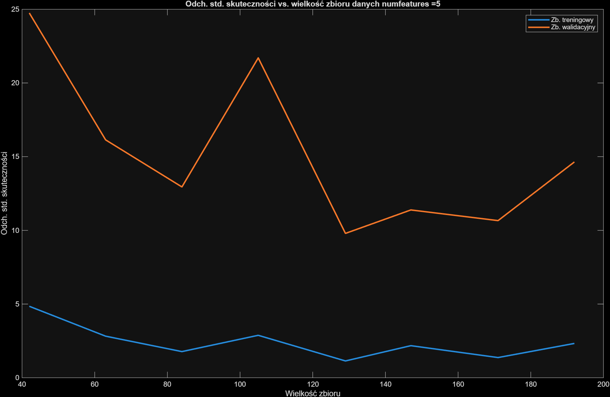
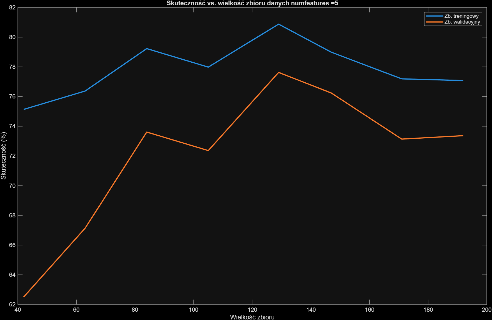
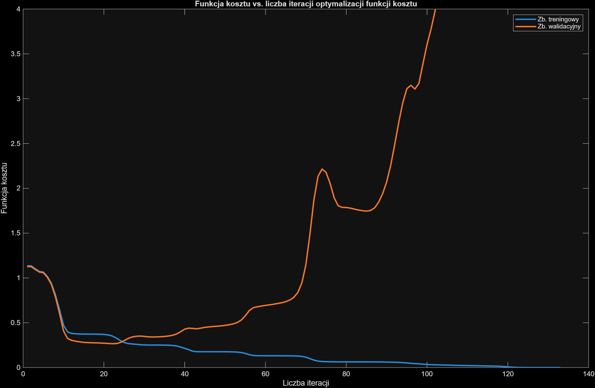
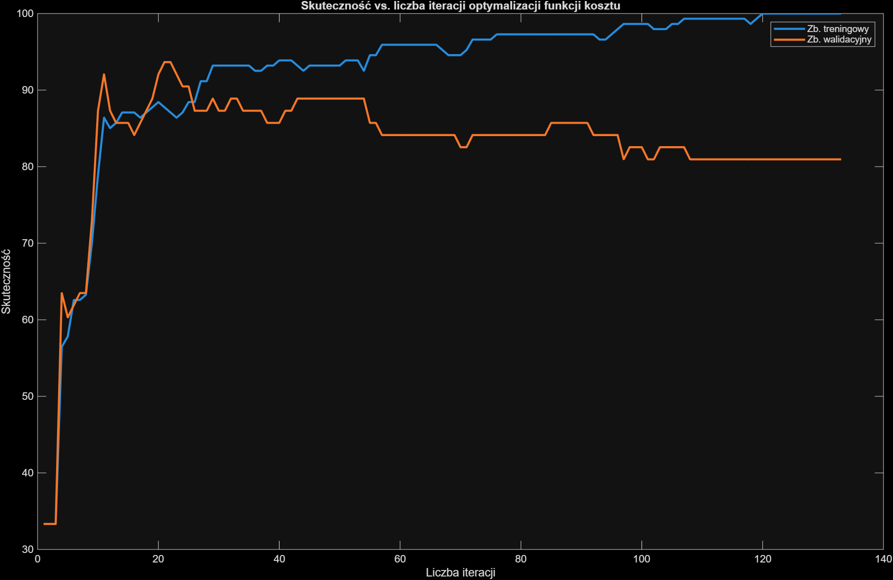

## Raport Lab 3, Część 1

### Zadanie 1
Wynik na zbiorze uczącym: 100%, zbiorze testowym: 81.(1)%. 

Osiągnięcie 100% wyniku na zbiorze treningowym, a na testowym wyraźnie niższego sugeruje overfitting. Model nauczył się wiernie danych uczących łącznie z szumem, pogarszając zdolność do generalizacji.

### Zadanie 2

Najoptymalniejszą liczbą cech w tym przypadku jest 10. 

Przy 10 cechach, model osiąga Skuteczność walidacyjną wynoszącą 82,86% przy niemal najniższym odchyleniu standardowym zarówno funkcji kosztu jak i skuteczności. Lepszą skuteczność walidacyjną osiąga jedynie przy 16 cechach, jest to jednak marginalna różnica (83,34%).
Przy zwiększeniu cech powyżej 14 dochodzi do drastycznego wzrostu kosztu walidacyjnego oraz utraty stabilności modelu.

### Zadanie 3

W modelu ograniczonym do 5 cech, zwiększanie wielkości zbioru treningowego przynosci umiarkowaną poprawę skuteczności z maksimum 77,63% skuteczności walidacyjnej przy 129 obrazach, większe zbiory powodują pogorszenie wyników.

Niezamknięta luka między kosztem treningowym a walidacyjnym sugeruje underfitting, zbyt prosty model z małą ilością cech nie jest w stanie zutylizować większej ilości danych.

Nieregularne i wysokie odchylenie standardowe wyników walidacyjnych pokazuje niestabilność modelu, utrudniając ocenę optymalnego rozmiaru zbioru.

### Zadanie 4

Na podstrawie wykresów wyznaczono zmienną sel_iter na 22, koszt walidacyjny osiąga minimum. Gwałtowny wzrost przy wyższych iteracjach sygnalizuje przeuczenie. Mechanizm wczesnego zatrzymania pozawala na zachowanie lepszej generalizacji modelu kosztem gorszych wyników na zbiorze uczącym.

Zauważalna jest poprawa skuteczności walidacyjnej w porównaniu z zadaniem 1 - wzrost z 81.1% do 87.7% (output konsoli).

!!! @TODO sprawdzić bo wykres nie zgadza się z outputem konsoli @ !!!

### Zadanie 5

Na podstawie iteracyjnego zagęszczania siatki wartości lambda zlokalizowano minimum funkcji ksoztu walidacyjnego w okolicach (WARTOSC), ze skutecznością walidacyjną osiągającą (WARTOSC).

Wybrana wartość stanowi kompromis między dopasowaniem do danych treningowych, a zdolnością do generalizacji.

### Zadanie 6

